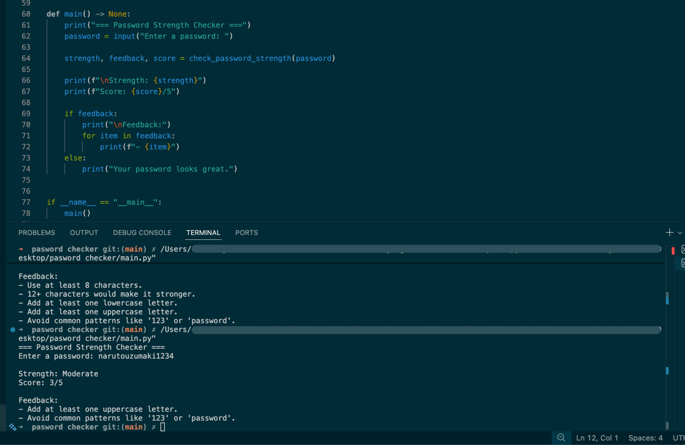

# 🔐 Password Strength Checker (Python CLI)

A simple command-line tool that evaluates password strength and provides feedback on how to improve security.

---

## 📸 Demo



---

## 🚀 Features

- Checks password length
- Detects uppercase and lowercase letters
- Checks for numbers and symbols
- Gives strength rating (Weak → Moderate → Strong → Very Strong)
- Provides clear feedback to improve the password

---

## 🛠️ Tech Stack

- Python 3

---

## ▶️ How to Run

```bash
git clone https://github.com/RavshanSean/Password-Strength-Checker-in-Python.git
cd Password-Strength-Checker-in-Python
python main.py
